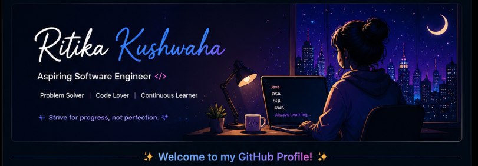

<p align="center">
  
</p>
<div align="center">


# 👋 Hi, I'm Ritika Kushwaha


<p>
<a href="https://github.com/Ritika-Kushwaha">

</a>


</p>

</div>

---

# 💜 About Me

```java
public class Ritika {

    String university = "VIT Bhopal University";

    String degree = "B.Tech CSE (Educational Technology)";

    String role = "Software Engineer";

    String[] languages = {
        "Java",
        "Python",
        "SQL",
        "C#"
    };

    String[] technologies = {
        "React",
        "TypeScript",
        "Firebase",
        "Node.js",
        "AWS",
        "Unity",
        "Git"
    };

    String currentlyLearning = "Advanced DSA + Backend + Cloud";

    String hobbies = "Coding | Open Source | UI Design";

}
```

---

# 🚀 Experience

🏆 **Google Summer of Code 2025 Contributor**

🌟 Open Source Contributor

☁ AWS Certified

🎮 Unity Game Developer

💻 React Developer

---

# 🛠 Tech Stack

<p align="center">


</p>

---

# 📌 Featured Projects

### 🚀 NxtStep

Career Counselling Platform

- React
- TypeScript
- Firebase
- Authentication
- Recommendation System

---

### 🎮 AlphaShot

Educational Game

- Unity
- C#
- Interactive Gameplay

---

### 🛒 Tryo

Full Stack E-Commerce Platform

- React
- Node.js
- Firebase

---

### 🚗 MarkDarshan

Community Platform

- React
- Firebase

---

# 📊 GitHub Stats

<p align="center">


</p>

---

# 🔥 GitHub Streak

<p align="center">


</p>
---

# 📈 Contribution Graph

<p align="center">

</p>

---

# 🏆 GitHub Trophies

<p align="center">


</p>

---

# ⚡ GitHub Metrics

<p align="center">


</p>

---

# 🐍 Contribution Snake

<p align="center">


</p>

---

# 💻 LeetCode

<p align="center">


</p>

---

# 🏅 Certifications

<div align="center">

🏆 Google Summer of Code 2025 Contributor

☁ AWS Cloud Practitioner

🏗 AWS Solutions Architect

📊 IBM Data Analysis with Python

🤖 Applied Machine Learning in Python

⭐ HackerRank 5★ Java

🚀 CodeSignal JavaScript Essentials

</div>

---

# 🚀 Currently Learning

```text
✔ Advanced Java

✔ Data Structures & Algorithms

✔ Backend Development

✔ AWS Cloud

✔ System Design

✔ Open Source
```

---

# 🌐 Connect with Me

<p align="center">

<a href="mailto:ritikakushwaha62@gmail.com">

</a>

<a href="https://linkedin.com/in/Ritika-Kushwaha">

</a>

<a href="https://github.com/Ritika-Kushwaha">

</a>

</p>

---

# 💜 Fun Fact

```java
while(alive){

    eat();

    code();

    learn();

    sleep();

    repeat();
}
```

---

<div align="center">

## ⭐ Thanks for visiting my profile!


</div>
